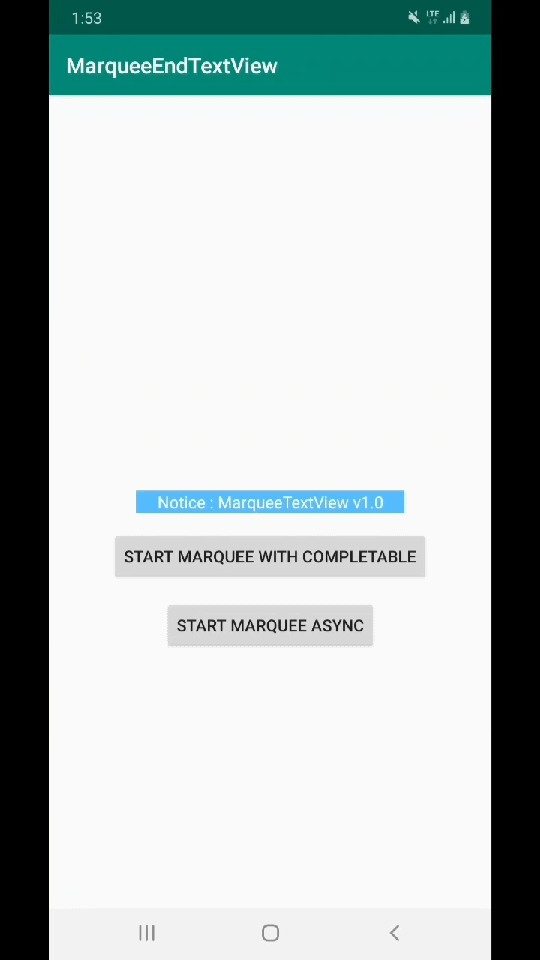

# MarqueeEndTextView
- This project is textView for marquee that stop when text is located end of view.

## Requirements
- Min Android SDK : 21 (Lollipop)

## Sample


## Example codes
### RxJava style
- Add dependency
```groovy
implementation 'io.reactivex.rxjava2:rxkotlin:2.4.0'
implementation 'io.reactivex.rxjava2:rxjava:2.2.11'
```

- Code
```kotlin
startWithCompletableButton.setOnClickListener {
    marqueeTextView.awaitStartMarqueeAnimation(
        delayMilliseconds = 500L,
        durationMilliseconds = 1000L
    ).subscribe({
        showCompleteToast()
    }, { /* do nothing*/ })
}
```

### Callback style
- Add dependency
    - Nothing

- Code
```kotlin
startAsyncButton.setOnClickListener {
    marqueeTextView.startMarqueeAnimationAsync(
        delayMilliseconds = 500L,
        durationMilliseconds = 1000L
    ) {
        showCompleteToast()
    }
}
```

### Coroutine style
- Add dependency
```groovy
implementation 'org.jetbrains.kotlinx:kotlinx-coroutines-core:1.2.1'
implementation 'org.jetbrains.kotlinx:kotlinx-coroutines-android:1.2.1'
```

- Code
```kotlin
startCoroutineButton.setOnClickListener {
    val deferred = marqueeTextView.awaitMarqueeAnimation(
        delayMilliseconds = 500L,
        durationMilliseconds = 1000L
    )
    CoroutineScope(Dispatchers.Main).launch {
        deferred.await()
        showCompleteToast()
    }
}
```